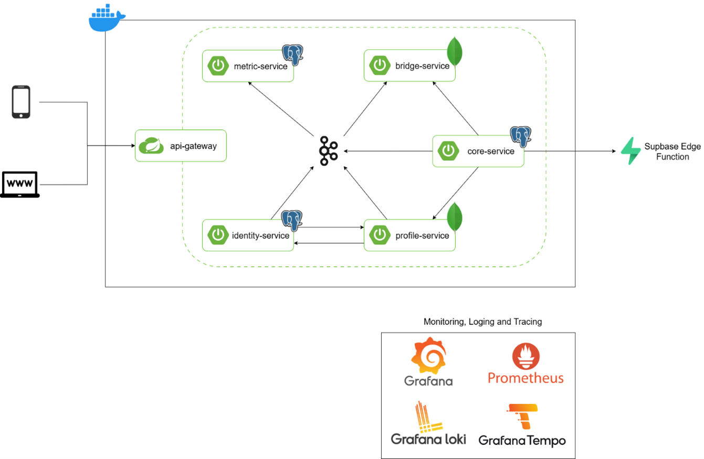
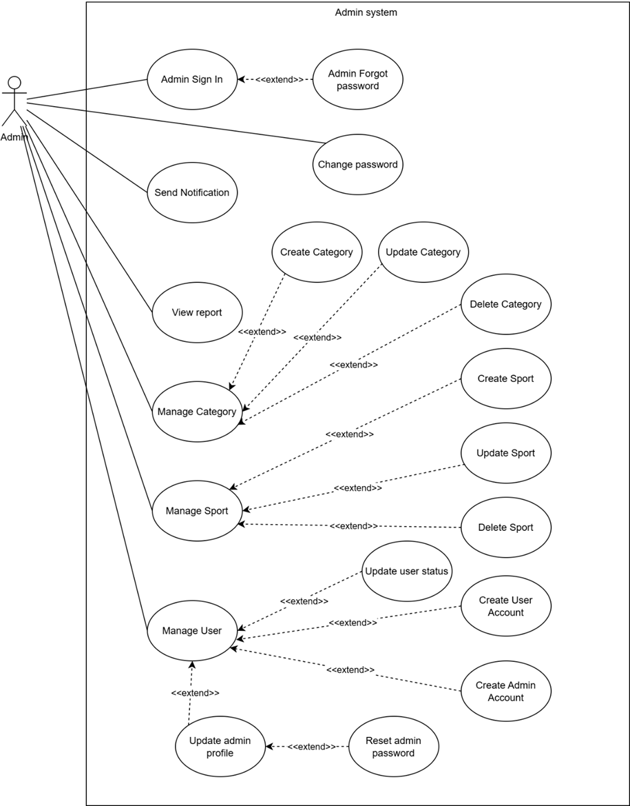
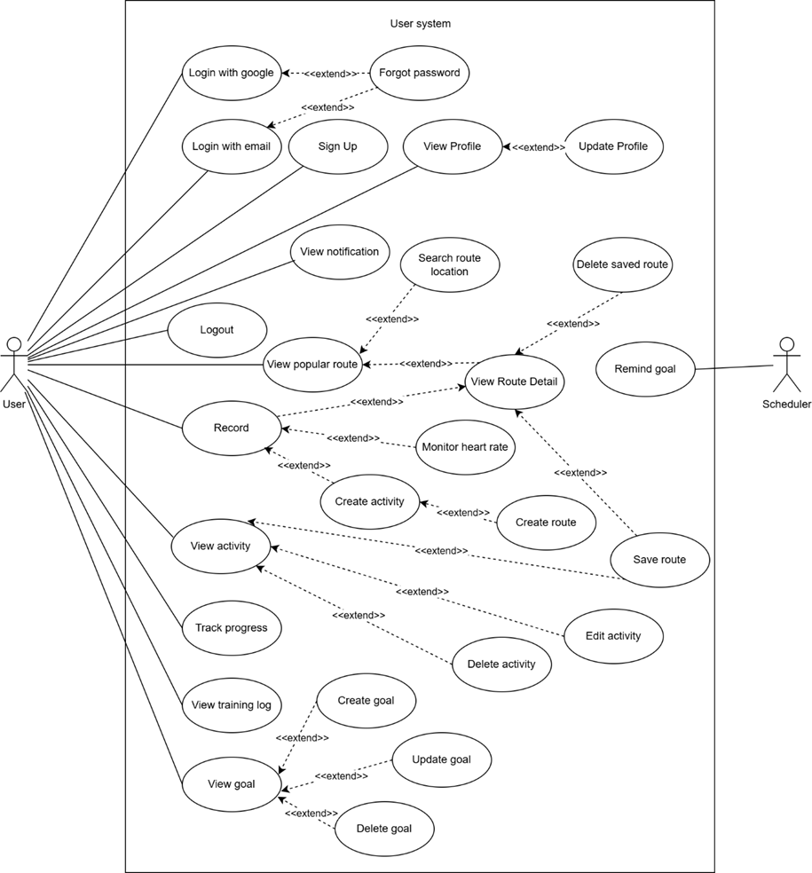
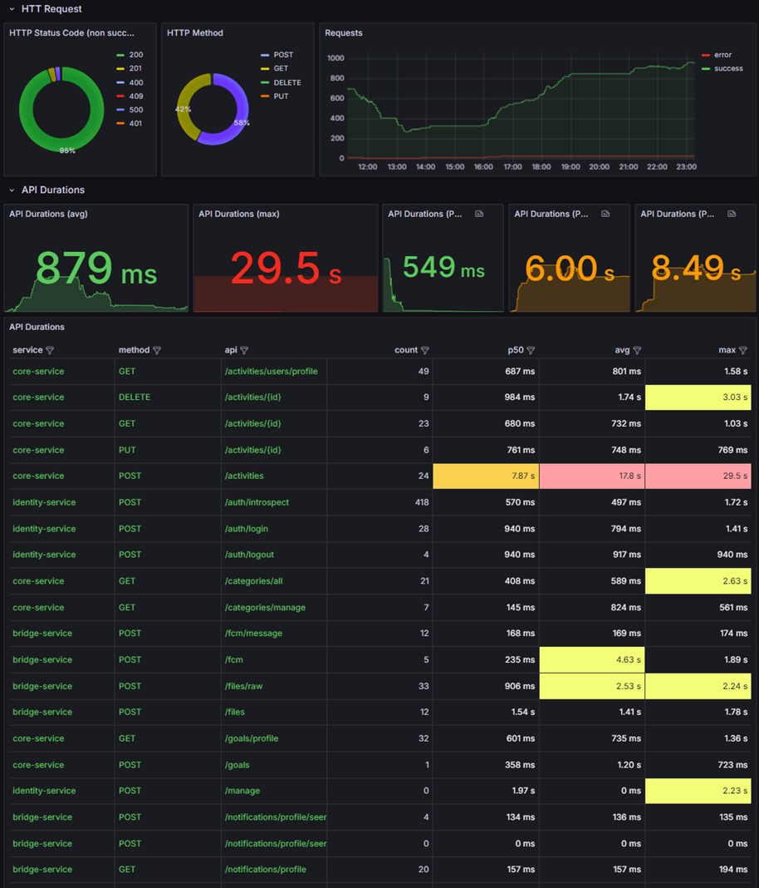

# Stride backend

> [!Note]
> **Other repositories**
> - [stride-common](https://github.com/NLNM-0-0/stride-common): Defines shared configurations used by multiple services.
> - [stride-dto](https://github.com/NLNM-0-0/stride-dto): Defines the DTOs used across services.
> - [stride-config](https://github.com/NLNM-0-0/stride-config): Manages runtime environment settings.
> - [stride-fe](https://github.com/ZenyB/stride-fe): Mobile app
> - [stride-admin](https://github.com/kimthu09/stride-admin): Web admin

## Description


- **Stride** is an microservices system for tracking sports activities, visualizing routes, and analyzing workout performance using data from smartphones and smartwatches. Most features are powered by **Mapbox APIs**.
- I used **Spring Boot** for service development and **Spring Cloud** for the gateway and configuration server.
- **GitHub Packages** is used for artifact storage and distribution. **GitHub Actions** and **Docker** handle automated deployment and containerization.
- I also used **Kafka** for service synchronization. For real-time performance monitoring, error tracing, and incident analysis, the system integrates **Grafana**, **Prometheus**, **Loki**, and **Tempo**.
- Additionally, it supports **OAuth2** for authentication and **Firebase Cloud Messaging** for real-time notifications.
- **PostgreSQL** and **MongoDB** are chosen based on service requirements, with PostgreSQL extended by TimescaleDB for efficient time-series queries and PostGIS for spatial data and geographic computations.

## Usecases
### Admin usecases

### User usecases


## API Docs
> [!Note]
> [Postman](https://documenter.getpostman.com/view/30541820/2sB2j7d9ep)

## Demo
### Backend

### Mobile
Here is link video: [youtube](https://youtu.be/MwxNxFGHnG0)
[](https://www.youtube.com/watch?v=MwxNxFGHnG0)
## How to run backend
- **Step 1**: Open the file *z-etc/bash/config-paths.env*.
  Update the values of *CONFIG_DIR* and *SOURCE_DIR* to point to the paths of the stride-config and stride-be folders respectively.
- **Step 2**: Go to the stride-be/z-etc/bash directory
``` bash
cd z-etc/bash
```
- **Step 3**: Run the *sync-config-repo.sh* script in the stride-be/z-etc/bash directory to sync the config:
```bash
./sync-config-repo.sh
```
- **Step 4**: From the stride-be directory, start the services with:
``` bash
docker-compose -f docker-compose-dev.yml -f docker-compose-log.yml up -d
```